# Docker
- [Commands](https://kubernetes.io/docs/reference/kubectl/cheatsheet/)


### Deploy
`````
./deployment/deploy.sh
`````

output
`````
------ POD ID: springrestbootk8secret-deployment-9f86d8b55-hqx2p 


 -- MiniKube IP: 192.168.99.101 
 -- NODE PORT: 32098 


--- content-type: application/json, URL: 192.168.99.101:32098/v1/ 

Welcome to Spring Rest + Boot + K8 environment variables example 
 
----------------------------------------
Configuration properties
 		 db.url = jdbc:mysql://localhost:3306/springK8Sdb
 		 db.username = helloK8sName
 		 db.password = HelloK8sPassword
----------------------------------------

--- content-type: application/json, URL: 192.168.99.101:32098/v1/123

{"id":"123","firstName":"Krishna","otherInfo":"\n----------------------------------------\nConfiguration properties\n \t\t db.url = jdbc:mysql://localhost:3306/springK8Sdb\n \t\t db.username = helloK8sName\n \t\t db.password = HelloK8sPassword\n----------------------------------------\n"}
----------- [DONE] DEPLOY: 2019-06-11 20:45:55 

`````

### Remove image
`````
./deployment/undeploy.sh
`````


## Unit-Test
### GET url: http://localhost:8080/v1/
- Terminal
```
curl localhost:8080/v1/
```
- Response: body
```
Welcome to Spring Rest + Boot + K8 environment variables example 
 
----------------------------------------
Configuration properties
 		 db.url = jdbc:mysql://localhost:3306/springK8Sdb
 		 db.username = helloK8sName
 		 db.password = HelloK8sPassword
----------------------------------------
```

### GET url: http://localhost:8080/v1/123
- Terminal
```
curl -H "content-type: application/json" localhost:8080/v1/123
```
- Response: header
```
	status: 200
	CurrentTime: 
	
```
- Response: body
```
{
	"id":"123",
	"firstName":"Krishna",
	"otherInfo":"\n----------------------------------------\nConfiguration properties\n \t\t db.url = jdbc:mysql://localhost:3306/springK8Sdb\n \t\t db.username = helloK8sName\n \t\t db.password = HelloK8sPassword\n----------------------------------------\n"
}
```


----------

### Namespace
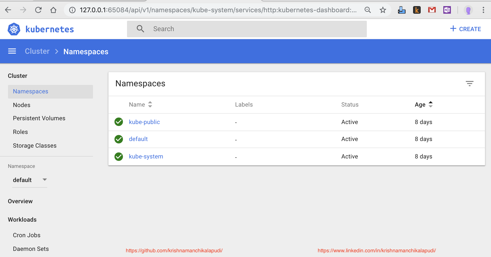


### Project Namespace
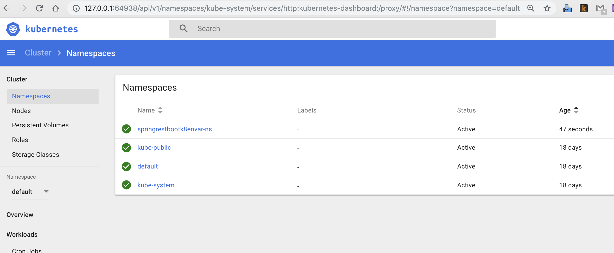

### Service
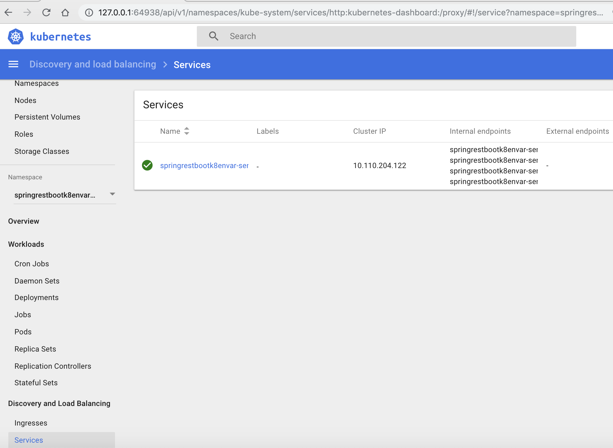
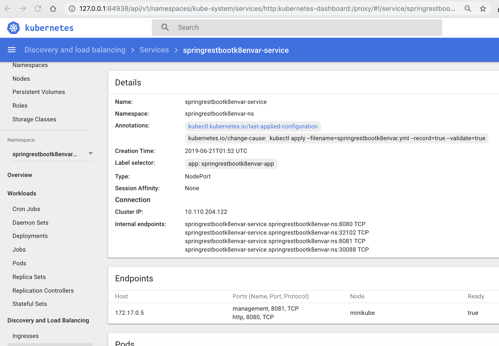

### Service - Deployment
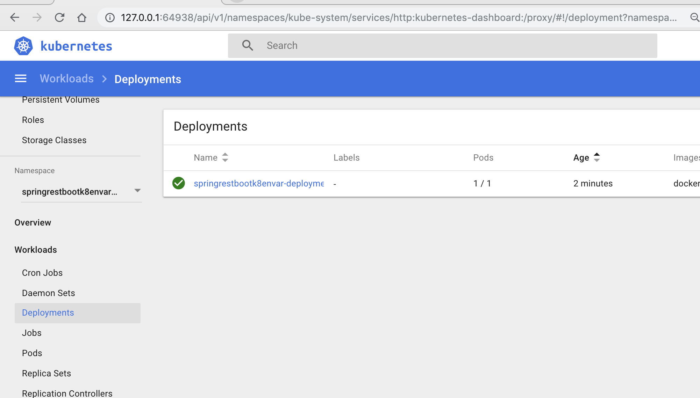
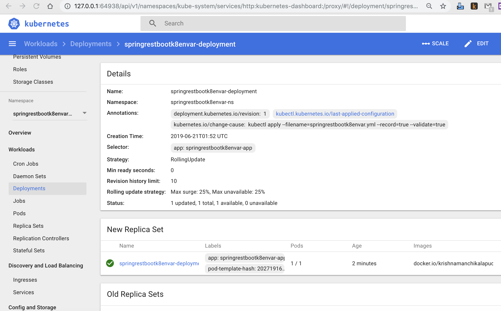

### Service - Pods
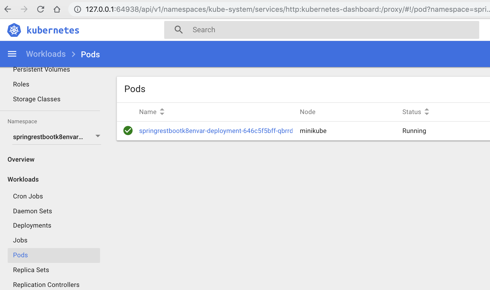
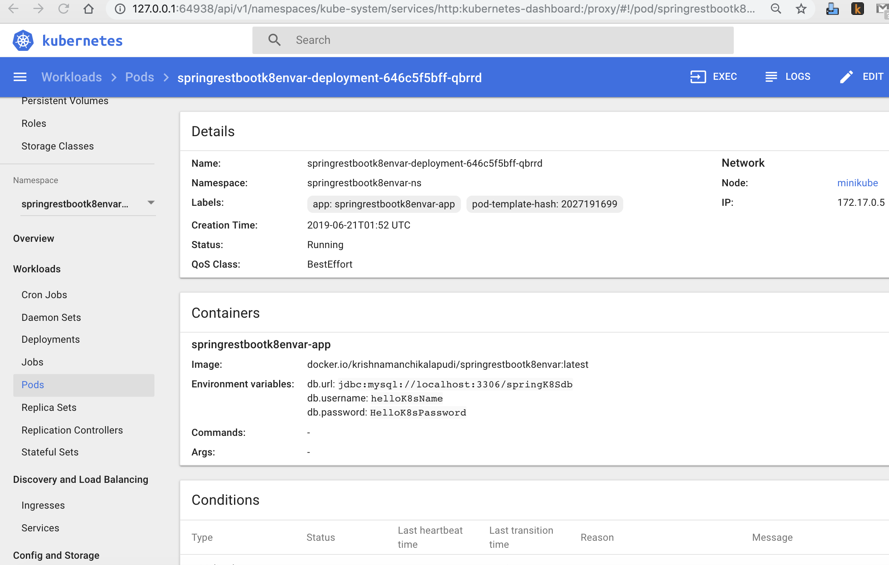

### Service - Replica Sets
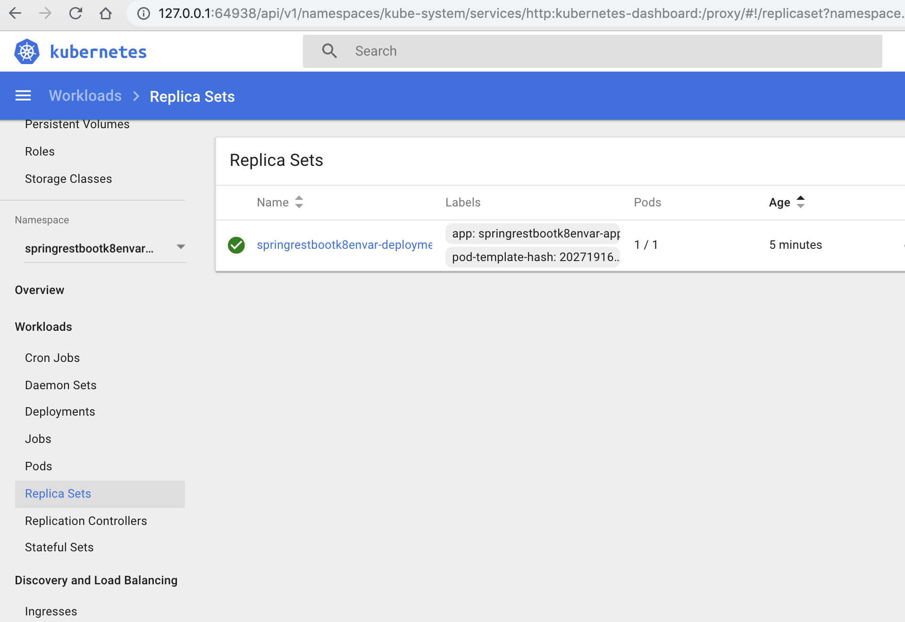


### Service - Ingress
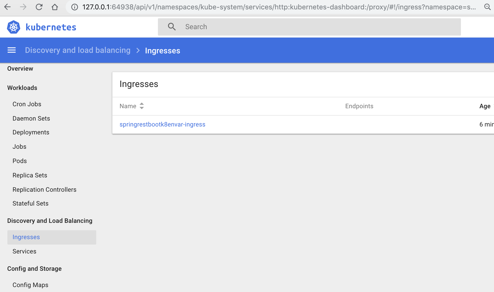
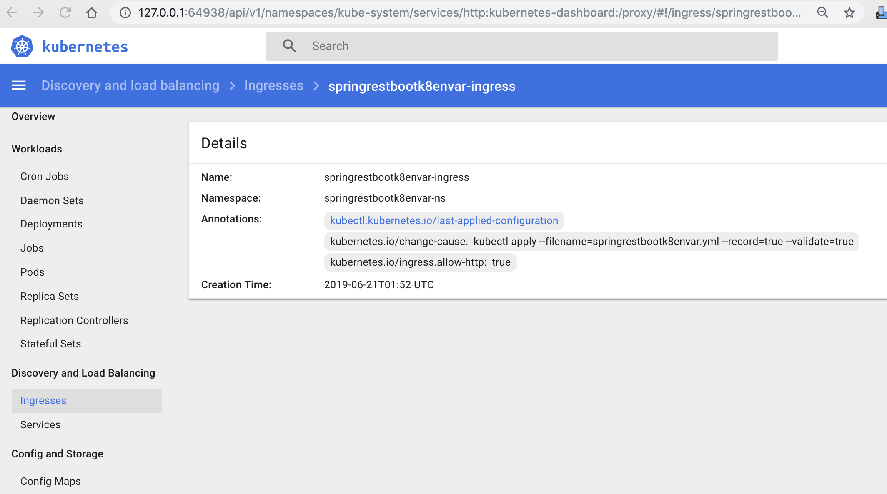

